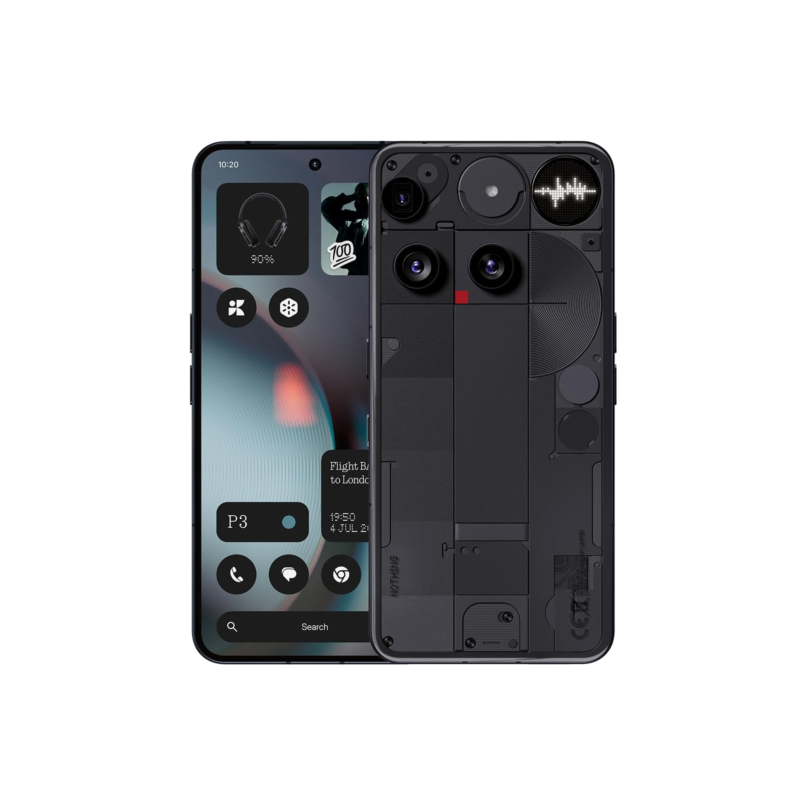
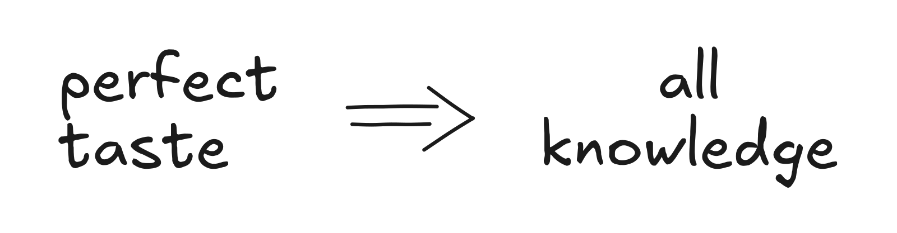
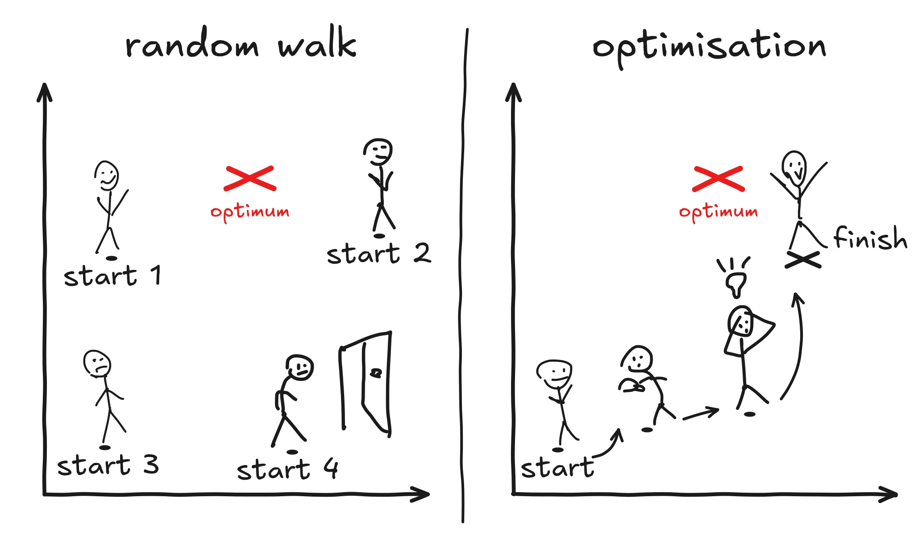
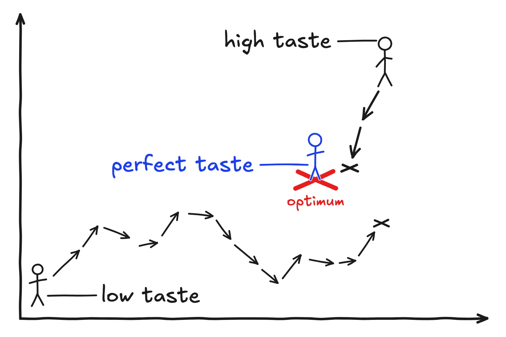
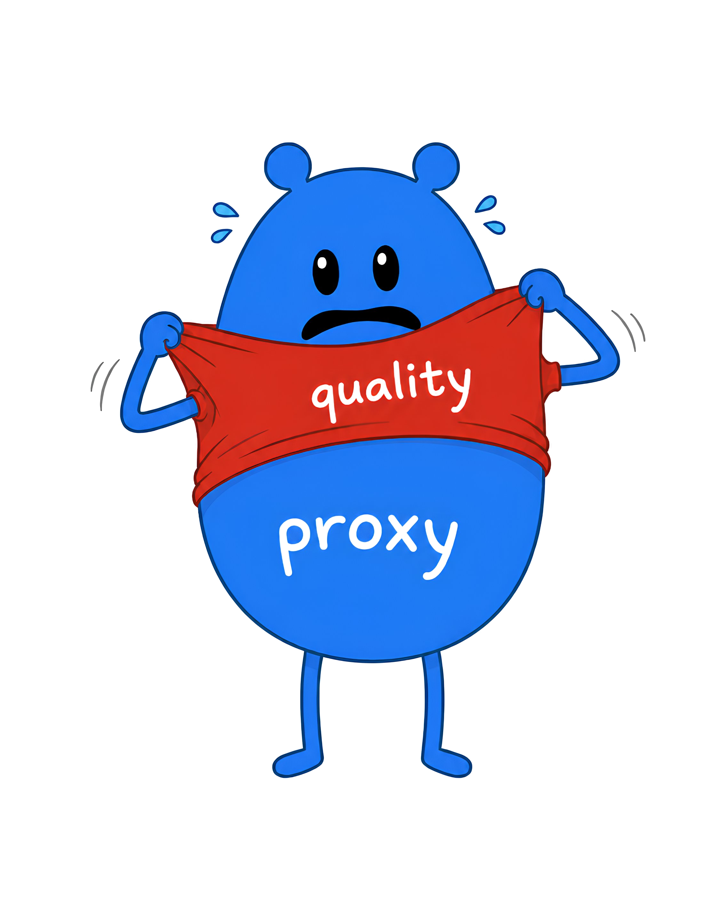

Taste is a skill that lets you understand the delta between the reality and the ideal state better by having a more accurate vision of the ideal state itself. The better your taste, the more likely you are to achieve the goal and the faster you are. A lack of taste is compensated for by creating quality proxies and optimising for them.

---

What is quality? Robert M. Pirsig, an American author, had a mental breakdown trying to figure it out.

For this essay, when I say "a ballpoint pen is better than an ink pen" I mean that a ballpoint pen is of higher quality than an ink pen. So the word "better" carries a quality comparison.

Let's get a more illustrative example.

## Comparing Phones

Nothing Phone 3 and iPhone 16e

Comparing the messy design of a Nothing Phone with an iPhone seems extreme enough.

It's hard to say why Apple's design is better, but let's consider a few characteristics and think about what a phone should be.

On the left we've got a device that screams "Look at me, I'm different." It has got 3 cameras placed in a dubious way, elaborate industrial design of irregular plates and some alive panel on the back. Your grandma would never touch this device comfortably.

On the right, we've got the iPhone - a brick with very few elements that almost always just works. It's the default and every other phone tries to be impressive to beat it.

Every tool has functions, and the utility of a tool is defined by how well those functions are implemented.

iPhone is great because it's like a pickaxe - every single element of it is there to serve a functional purpose. Nothing Phone has many vanity elements (like the shiny back LED circle) which are added for reasons distant from serving its functional purpose as a tool. Nothing Phone is a statement.

iPhone is of higher quality than Nothing Phone.

Nothing Phone has to be a frankenphone to have any chance at wedging into the oversaturated market of phones. But the issue is that it tries to solve an already solved problem without having a 10x insight, which is at its least very boring, but more so displays a lack of taste in the choice of the problem to solve in the first place.

The lack of taste here is manifested in the poor vision of the creators of Nothing Phone of the final state of the world after the Nothing Phone. The total utility delivered is marginal. The authors are either very unambitious or they overestimated the impact of their creation. Which all points to the root - they couldn't see the ideal state of the world accurately. A lack of taste.

## Perfect Taste

To have a perfect taste would be inhuman. As a mental exercise let's imagine how would an absolute perfect taste get manifested if it existed. Absolute meaning across all domains (wine, engineering, people, etc..). Perfect meaning of the highest degree.

It would mean trying 500,000 grapes from a vineyard and selecting one which if cultivated further would produce the best wine, here the maximum of the aggregate of how much pleasure it would deliver across all its drinkers.

Selecting the grape would also depend on looking at the soil and realising that its contents of magnesium are higher than usual so smaller varieties of grapes would grow better and have a richer taste. Realising that in the previous year it was bad harvest in this field so this year we should expect drought in Mediterranean climate and more furry grapes would be better.

But I'm already creating proxies. The ultimate person would just try 500,000 grapes and select the best one without thinking about size/shape/furriness etc. (which are proxies for quality). For them it would be obvious which grape achieves the maximum for the utility of the grape, i.e. is of highest quality.

When pushing to the extreme, it becomes hard to distinguish perfect taste from all-knowledge. But there is a difference.

All-knowledge is a prerequisite of perfect taste. Necessary but not sufficient. The difference is that having all-knowledge you are still not endowed with the ability to connect the dots and perform computation over the knowledge you have.

Simply speaking, you can know the exact proportion of magnesium in the soil you are standing at just by raw knowledge of the coordinates you are at, but you still may lack the ability to connect that to how the grape should be for the highest quality wine. It's mere knowledge of facts.

If you have perfect taste, you must have all-knowledge. If you have all-knowledge, you could have perfect taste but it&rsquo;s not guaranteed.

---

Maximising quality is an optimisation problem. We haven't yet developed a system with a perfect taste (AI looks promising), so whether we are considering a human or a computer model, there exists a way to optimise for quality. Iteration.

To iterate we need three things. A starting point, a way to evaluate quality in the current position, and a way to decide the next step.

## 1. Start

When selecting the best grape for your wine a starting point could be to go to a grape seed shop and look at different varieties.

*Alright... Vitis vinifera is the standard one, a solid pick; labrusca is for stronger flavour.. rotundifolia is an interesting one, the shop owner told me it makes my hair thicker. That doesn't make any sense..*

You could as well sneak into the best wine producers' vineyard and steal some of their grapes, then cultivate them. That sounds like a better starting point.

## 2. Evaluate

Now, you need to evaluate the quality of your wine. That takes time, because you need to grow enough grapes, then harvest and then produce your wine before you can judge the quality by tasting.

*7 months after sowing the seeds you finally take a sip. Hmm.. it's sour, really sour and a bit sweet. But there is also some burnt taste. Bweh. So bad!*

Now the challenge is to connect those different sensations to the quality of the wine you produced. To do that requires what people usually call taste, although it's a very narrow definition of the subject of this essay. To develop wine taste people usually spend years tasting different wine, thousands of varieties. Those people even have a special name, sommeliers.

It's does not require high sense of taste to claim that Pinot Grigio (real wine) is better than MD 20/20 (grape juice with vodka sold as wine).

You only need it when you compare excellent wines. Maybe your previous year's harvest with the current if you are an acclaimed wine company.

So you invite one of those pompous guys and they tell you your wine would cost £5.49 on the shelf if it ever gets sold.

*Okay, the quality is probably low. Now, what do I do about it?*

---

To change the output you change the input. So you look at all the things your wine quality depends on: the grape quality, the soil, the weather, the brewery, the distillation process..

It's a long list, and it's not clear what to do. There are two options, really: you either blame the starting point and reselect it (which is random walk) or you make a step of the size you are comfortable with.

Start many times, fail to see progress and quit. Or try to make sense of the complex world and optimise.

## 3. The Step

Because there are so many variables here, constrained by your taste, you have to create quality proxies and optimise for them. So instead of asking whether increasing grape irrigation intensity makes wine of higher quality, you can say:

*Okay, I think (applying your taste) if my grapes have fewer seeds, that improves the wine. Also if the grapes are sweeter it also makes wine of higher quality.*

You managed to distill the vague quality of your wine down to 2 concrete and measurable numbers: number of seeds per grape and sweetness of the grapes.

Those two numbers are proxies for quality. The evaluation step became faster as there is no need to brew wine for tasting anymore - you can just count the number of seeds in the grapes and taste the grapes for sweetness.

With proxies it also became clearer what to do about improving quality. You can choose one of them, say the number of seeds per grape, and do the next step just in order to decrease the number of seeds.

It is a much easier problem to just decrease the number of seeds. You can go to a seeds shop and ask them which grape type has the least number of seeds and grow this new grape. Bingo.

Then you go back to **2. Evaluate** and repeat until you are satisfied with the quality.

---

Here the higher your taste, the bigger steps of change within an iteration you can take.

So with no taste you can change just one input, say you change the amount of potassium fertiliser from 2kg to 5kg per square metre and then observe that the number of seeds decreased per grape.

*Ohhh! Breakthrough: putting more fertiliser makes better wine!! Let's put 100kg per square metre next!*

With better taste you can change more things at once without losing the sense of what's going to happen. **You walk faster.**

So what's the role of taste here?

Practically, you get excellent wine in 24 months instead of never (in capitalism, if you are slow, your business gets bankrupt before reaching excellent wine quality).

Or, if say Alice has higher wine taste than Bob, then it takes 3 steps for Alice to achieve excellent quality, whereas Bob needs 16 steps to achieve the same result.

---

What would the perfect taste person do? They would probably know where the best grape is for their soil. They then steal it and start cultivating. And build the entire manufacturing process right from the first time. No iteration needed. No proxies needed. Quality is native.

*If you had a perfect taste you wouldn't need any iteration because your starting point is already the optimum. Your step 0 is better than step 100 for any human alive.*

The difference taste makes when iterating. Notice that with higher taste you: 1) Start closer to the optimum 2) Make bigger and more confident steps 3) Arrive closer to the optimum in the end

## Chasing Proxies

We almost always need proxies to make any meaningful progress. But we have to be aware that it's easy to fall into the trap of optimising for something that ceases to be a good proxy the moment that proxy becomes the target of optimisation in and of itself.

Untangle with an example:

Drel is the owner of a smart mattress company. Drel wants it to have the best customer service in the world. So their phone calling line has to be the best in the world. So he creates the following proxy for how good their customer service is:

*I think the higher our rate at which we pick up the phone within 2 seconds of a call the better our customer service.*

Sounds valid indeed. What's the problem?

H mattresses tend to break often. Because they are smart, the electronics tends to be faulty at times. So the customer support line gets many calls.

Drel finds out that initially their rate of pickup within 2s is only 36.7%!

So he mass hires cheap labour. There are 27 new workers now picking up phones instantly as their entire responsibility!

Within 6 weeks, the rate of 2s-pickup goes from 36.7% to 99.8%!

Sales drop for a mysterious reason over the next year. Drel pushes the department even further and spends all his efforts to push those last 0.2%. He hires 15 more workers to get to 99.95% of all calls within 2s pickup.

Within 2 years his business goes bankrupt.

*How can that be?! Our customer service was excellent, probably the best in the world! Nobody else has the rate of 2s-pickup even close to ours!*

Well, the problem is that all the cheap workers could barely speak any English. And the mattresses - the core product of the company - are dogshit quality, because the owner spent all his time optimising for a proxy as the main goal, rather than focusing on the product.

He wouldn't need customer service at all if his mattresses were excellent, and improving the quality of mattresses would've been a much better use of his time and money.

Drel's vision of what's important for the company was poor. He was unable to see the bigger picture. A lack of taste.

---

Proxies are not bad in themselves. They help massively to navigate the complex world of multidimensional nature. The issue with proxies appears only when a **single proxy** substitutes quality as the goal.

So for any company usually the goal is to raise the quality of the company. And quality is enough in itself to encompass all the factors that make great companies: the product, team, customer service, timing, investors, etc.

A proxy struggles to be quality

Quality is the highest form of evaluation. It practically encompasses everything, but that makes it hard to quantify.

Any proxy that tries to be quality in itself will not be able to do that on its own merit. And that only becomes noticeable when you push it far, like Drel did.

This is called the Goodhart's Law.

## How To Use Proxies Right

The solution is to have multiple counterbalancing proxies for quality. Business people like to call them KPIs.

For Drel, if he really wants his customer service to be great without cannibalising on the quality of other parts of the company too much (as simple as money poured into caller salaries instead of product R&D), he can set the following targets:

- 2s pickup rate above 90%
- Net Promoter Score (a KPI) above 30

The greater observation is that you don't really need the best customer service in the world if what you really want is a great company. The money and effort would rather get spent elsewhere.

It is a strong commitment to create a free proxy without a satisfaction target, i.e. a number you will try to maximise regardless of reaching any specific levels (like 90% and 30, respectively, above). Only assign those for things of great importance.

For example:

- Company's profit

It's a good idea to try to increase profit indefinitely. But this proxy has to have a counterbalance. To assign counterbalance proxies you have to think of what this proxy alone can lead to?

*But how can trying to maximise profit be bad?*

The problem is a shortcoming of humans. On average we cannot see too far ahead, so we prioritise safe short-term bets even if they cost us long-term prosperity and survival. On average, humans are greedy optimisers.

*If it's 2 years ahead, why worry about it now? Especially, if that allows us to make an extra buck now.*

Imagine a miner drill. It is very expensive. To function it needs 2 things: maintenance and care of use.

Alex has just become a miner. He decides to completely neglect the drill and abuse it to the fullest.

*Alex, my boy, no way you are mining 90% more coal than others!*

He gets promoted and paid a premium for his excellent work 3 months after. He becomes a miner manager and stops having to mine.

Alicia has just become a miner. She gets Alex's half destroyed drill. She handles it with extra care and spends a lot of her time for maintenance. She mines less than Alex used to. And less than an average miner, because the drill needs so much maintenance after Alex's abuse. And after 4 months the drill breaks anyway. Where it was meant to serve for 5 years.

*I'm tired of this. Alicia, your output is 30% lower than an average miner. You are a slacker - always sitting at the workbench tweaking your drill. No wonder it broke. You know how much that drill costs? More than an entire year of your salary!*

Alicia gets fired.

## Now, who is wrong?

The manager.

For assigning the wrong incentives and proxies. The implicit proxy for miners to optimise for is:

- Amount of coal mined

But there is no incentive to care for the drills which are really expensive. Worse. There is an incentive to abuse the drill. So that's what people end up doing. And long-term the mining business goes bankrupt because "this generation has no care about the drills" or whatever the reason the manager comes up with to avoid responsibility.

So what's the solution? It's going to be a second proxy for evaluating the quality of miner's work. I have to repeat again, that a standalone quality proxy (Goodhart's Law) always diverges from quality itself when optimised for in the long run without counteraction.

In this case we need something that pulls in the direction where miners care about the drill so much that they don't use it at all and mine no coal. So the opposite of the **1. Amount of coal mined** proxy.

Let's say the maintenance for the drill needs to be done weekly. So the manager has to create a mandatory weekly workbench time slot where every single miner goes and does maintenance. Every miner has to get signed in and signed out. On the sign out, they get checked on whether maintenance has been done.

This method is perfect assuming your miners are reactive and unintelligent.

If you had a team of clever and high-agency miners, I would avoid this kindergarten/prison method of supervision. You don't want to treat smart workers as if they are stupid. To leverage their ability to the fullest, give them more freedom but align the incentives right and make them respected.

Let them do the maintenance on their own schedule. But then, quarterly, you check how much of the lifespan of the drill have the workers used. Let's assume linear decay for simplicity. So if the drill usually works for 5 years, then it uses up 100% of its lifespan in 5 years. That makes 20% in 1 year (divide 100 by 5), and 5% lifespan loss every quarter (divide 20 by 4).

Now make the following two proxies for evaluating the quality of a miner's work:

1. Amount of coal mined
2. Drill lifespan maintained

To make those respected, make salary proportional to the amount of coal mined. And then make painful salary deductions for exceeding the drill's natural lifespan loss as a counterbalance measure.

In that way, the higher the quality of a miner's work, the more they get paid. Couldn't make it more fair.

The exact numbers of how much carrot and stick to give are yours to figure out. With such incentives though, you can make them native to how your company operates. You naturally get more revenue when your miners mine more coal. So miners get a fraction of it. And you naturally lose money when drills break prematurely. So miners absorb your costs here.

Win win.

The real world is much more complex than this idealised example. There is a lot of nuance. This is where you have to apply your taste to navigate the complexity effectively by selecting the right proxies for evaluating the quality accurately.

## How To Improve Your Taste

To reiterate, taste defines how accurately you see the ideal state of the world. Very importantly, **across time.**

Higher taste is a better ability to connect different events together and applying your factual knowledge effectively to see the ideal state.

The primitive form of seeing the ideal state is predicting the future in different ways. Making bets.

To improve your taste in wine, you have to iterate on wine. If you are a sommelier and you are training your wine-tasting abilities, you need to first learn the facts about different brands of wine and different harvests of grapes. There is so much to learn. You have to be able to compress this knowledge in your head to use it at all, rather than just be able to regurgitate raw facts dumbly.

Then the crux. When you taste a sample of unknown wine, you make a few bets right after:

*Hmm.. this slightly sour and nutty taste gives Argentinian fields. It might also be Australia. Yeah Australia feels more right. And it's very dry so I'm expecting 2016 or 2018 harvest when they had droughts. The colour is so intense, it's going to be the upper end. Okay. That's Australia, Barossa Valley, 2018 harvest and costs £60.*

The bet is made. Now the learning moment. That was actually cheap South African Shiraz, Western Cape, 2023 harvest, £6.

The discrepancy between your bet and the reality is where you have to connect the dots and make the learning happen. The next time you taste the same wine there is a higher chance you get it right. And that slightly too dry taste will hint you that there could be something cheap going on (make the learning happen).

This is how you improve your wine taste.

---

More generally, usually there is a time delay from the moment you make your iteration **and make your bet on the outcome**, and the next evaluation of the result.

For example when you try to grow that perfect grape, you try increasing potassium fertiliser from 2kg to 5kg. You then make a bet that this is going to decrease the average number of seeds per grape from 4 seeds to 2 seeds.

But then you have to wait for 6 months until your new grape harvest actually grows and you can evaluate the number of seeds per grape. That makes taste development take longer timeframes if you are a grape farmer. Your iteration cycle is slower than that of sommeliers (they get evaluation almost instantly).

How good your taste is boils down to the volume of your bets. A reminder that you have to actually connect the dots when your bet differs from the reality.

To improve your taste make more bets.

## Attain Your Goal

For any goal, let's say that the quality of your attainment is how close you are to your goal.

E.g. if you want to reach £1b net worth, then being at £100m is of higher quality than £10k.

The above example is simple in terms of evaluating the quality. Just look at your net worth. But even here it's not as simple as just that. I'm not a billionaire, but I would guess to reach £1b requires spending a lot of time without getting paid, doing long-term work where you probably lose money at first (like in business) and taking a considerable amount of risk and responsibility, rather than greedily hammering three 9-to-5 jobs (even though short-term the net worth grows whereas in business it doesn't).

So you almost always need some proxies for evaluating how close you are to your goal. Your proxies can evolve as you move through levels of attainment.

E.g. it's a very different game to go from £0 to £1k versus £1m to £1b so you need different ways to measure the quality of your attainment. Hence, different proxies.

As an example of the proxies you can use here:

- Hours per week devoted to a long-term commitment [More is better]
- Do I only have a single long-term commitment? [Yes is better]
- Have I changed my long-term commitment within the last 10 years? [No is better]

That's quite an extreme case, but reaching £1b is extreme too. Your proxies have to match your goal.

A thing to keep in mind is that the higher your taste the fewer proxies you need. A full newbie might need 6 proxies for quality to make any evaluation, but as they become sharper, their proxies become sharper too and they need fewer of them.

The ultimate form of this is the perfect taste person who doesn't need any proxies at all and can evaluate quality directly.

---

Goals can be different. Some involve heavy optimisation and search, like cultivating the best grape. Others can seem much more remote from this paradigm. Like the goal of being a 'good man'. You would still probably optimise yourself as a person to approach your vision of what a 'good man' is.

The purpose of this essay is to give you some practical fundamental frameworks - a potentially new lens of looking at the world.

It might start with defining quality proxies for your goals, thinking thoroughly through your incentive structures, considering what to tweak next in your iteration, make your first bet and wait until the next evaluation to reconcile it with what the reality gives you.

As you do the learning and improve your taste, you start needing less and less of this structure.

Finally, I hope at some point your gut becomes your ultimate compass. When it comes, drop the structure, and trust it with your heart.
